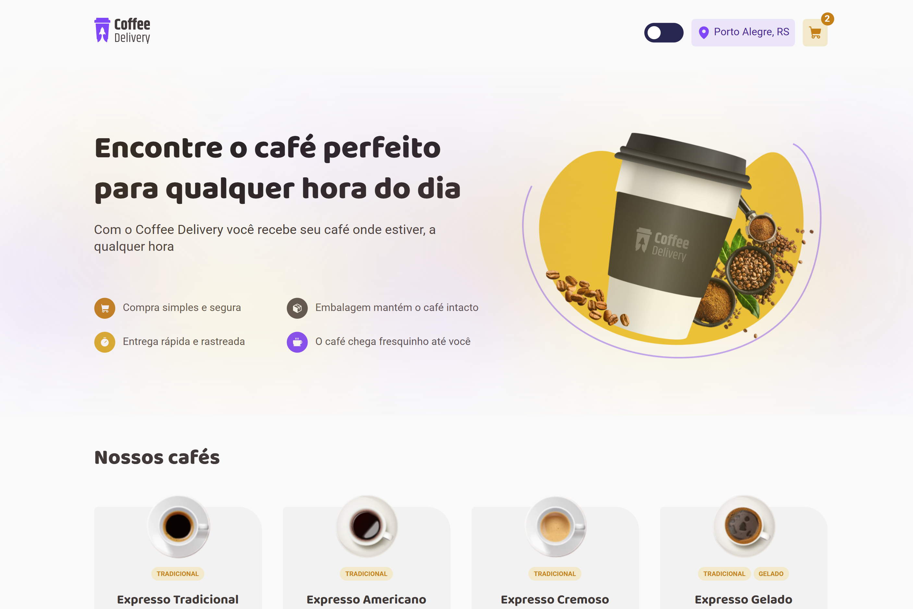
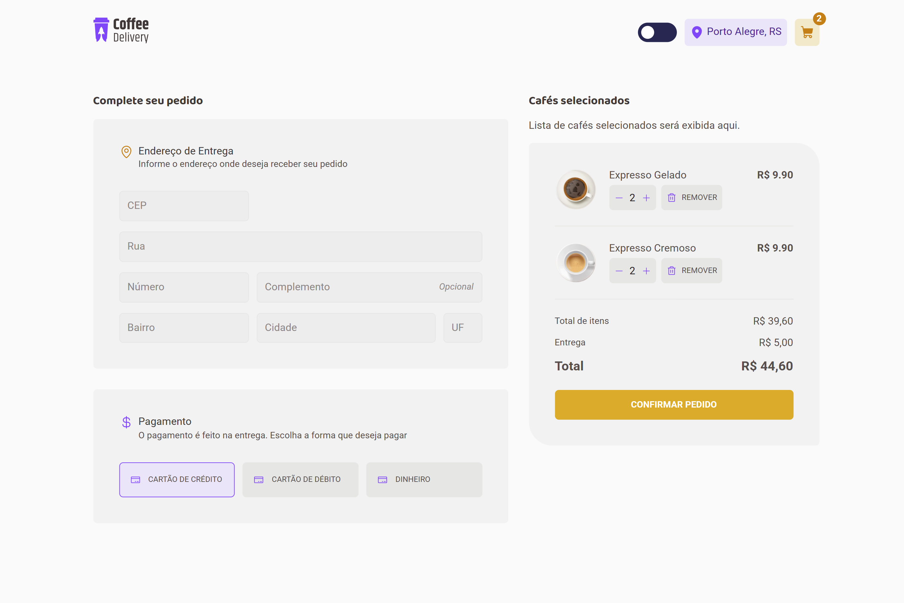
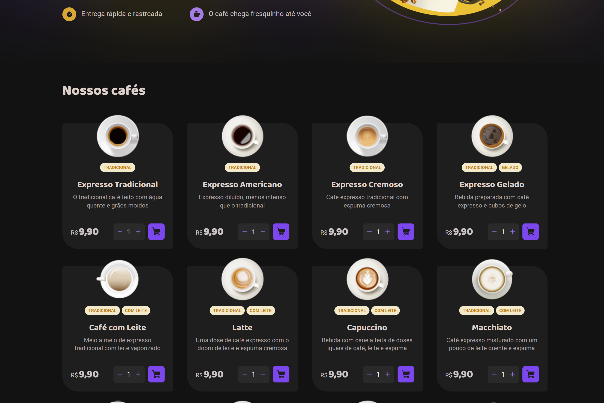

# ☕ Coffee Delivery React
<p align="center">
  
  
  
  
  
  
  
  

  

  <a href="https://github.com/emanuelhenrique-dev/Coffee-Delivery/commits/master">
    
  </a>

  <a href="https://github.com/emanuelhenrique-dev/Coffee-Delivery/issues">
    
  </a>
</p>

<p align="center">
  
</p>

Aplicação de entrega de cafés desenvolvida em **React + TypeScript** com o Vite, com gerenciamento de estado, temas e listagem de produtos.

## 🚀 Tecnologias

- React
- TypeScript
- Styled-Components
- Vite
- Zod (validação de dados)

## 📦 Funcionalidades

- Listagem de cafés com imagem, nome, descrição e tags
- Carrinho de compras
- Tema claro e escuro
- Responsividade básica

## 📝 Coisas aprendidas

Durante o desenvolvimento, algumas experiências importantes foram:  

- Como usar **React Context** para compartilhar estado global entre componentes.  
- Implementação de **Reducer** para gerenciar estados complexos, como o carrinho de compras, de forma previsível e escalável.  
- Tipagem em TypeScript para garantir que o estado do Context seja seguro e previsível.
- Uso de **Styled-Components** para estilização dos componentes
- Organização de dados (ex.: array de coffees) de forma estruturada para consumo pelo Context.
- Uso de **Zod** para validação de objetos, além da integração com TypeScript.


```ts
// Exemplo de uso de Context + Reducer
const [state, dispatch] = useReducer(cartReducer, initialState);

<CartContext.Provider value={{ state, dispatch }}>
  {children}
</CartContext.Provider>
```
<p align="center">
  
   
</p>
